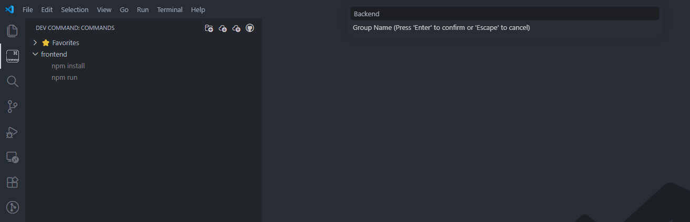
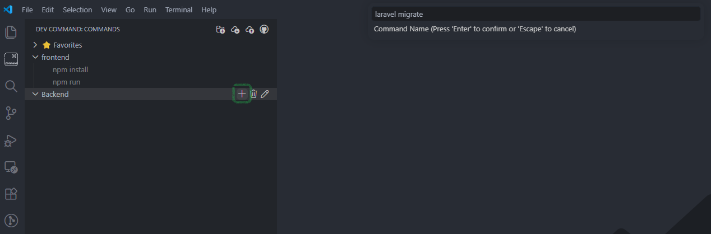
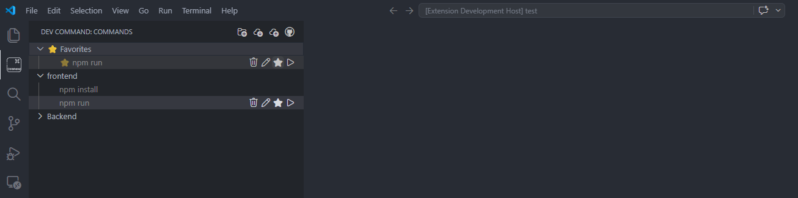
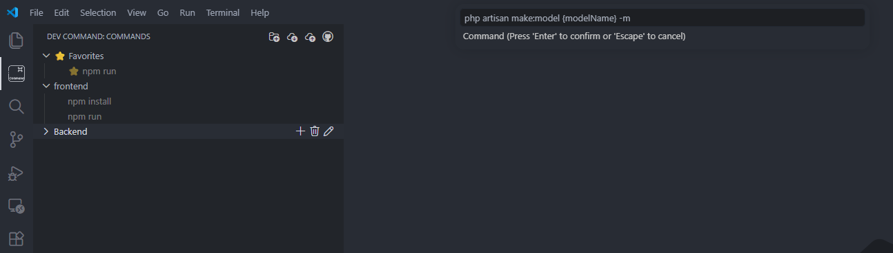
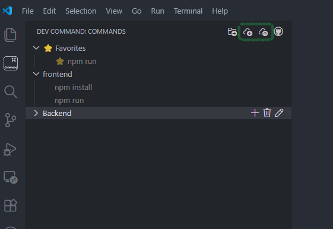
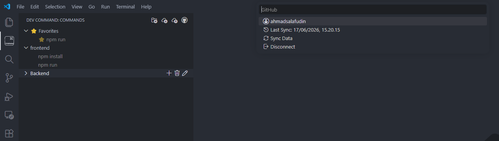

# Dev Command Line

<p align="center">
  
</p>

<p align="center">
  Manage, organize, and run reusable development commands directly inside VS Code.
</p>

---

## 1. Menu

Berikut adalah daftar menu yang tersedia di sidebar **Dev Command Line**:

| Menu                   | Deskripsi                                             |
| ---------------------- | ----------------------------------------------------- |
| **Create Group** | Membuat grup untuk mengelompokkan perintah            |
| **Add Command**  | Menambahkan perintah baru yang bisa digunakan kembali |
| **Run**          | Menjalankan perintah langsung dari sidebar            |
| **Edit**         | Mengubah nama atau isi perintah                       |
| **Delete**       | Menghapus perintah atau grup                          |
| **Favorite**     | Menandai perintah sebagai favorit agar mudah diakses  |
| **Import**       | Memulihkan koleksi perintah dari file JSON            |
| **Export**       | Menyimpan semua perintah ke file JSON sebagai backup  |
| **GitHub**       | Mengelola sinkronisasi perintah dengan GitHub         |

---

### Create Group

Kelompokkan perintah agar lebih terorganisir.



Contoh:

```
Frontend
 ├── npm install
 ├── npm run dev

Backend
 ├── php artisan migrate
 ├── php artisan serve
```

---

### Add & Run Command

Tambahkan perintah sekali, jalankan kapan saja dengan klik ikon ▶️.



Contoh perintah yang bisa disimpan:

```bash
npm install
npm run dev
```

---

### Favorite

Tandai perintah yang paling sering digunakan sebagai favorit agar mudah ditemukan.



---

### Command Parameters

Gunakan parameter dinamis di dalam perintah.



Contoh perintah:

```
php artisan make:model {modelName} -m
```

Saat dijalankan, akan muncul prompt:

```
Value for container:
```

Input: `Marketplace` → Hasil: `php artisan make:model {Marketplace} -m `

---

### Import & Export

Backup dan pulihkan koleksi perintah menggunakan file JSON.



Berguna untuk:

- Pindah ke laptop baru
- Berbagi template perintah dengan tim
- Keperluan backup

---

### GitHub Sync

Sinkronkan perintah ke repositori GitHub pribadi Anda.



Fitur:

- Hubungkan akun GitHub
- Buat repositori privat secara otomatis
- Upload backup perintah
- Sinkronisasi otomatis setiap ada perubahan
- Pulihkan perintah di perangkat lain

Contoh struktur repositori:

```
dev-command-sync
└── commands.json
```

Data tetap tersimpan di akun GitHub pribadi Anda.

---

## 2. Pengembangan

Proyek ini bersifat open-source. Silakan **fork** repositori ini dan lanjutkan pengembangannya!

```
https://github.com/username/dev-command-line
```

### Cara Menjalankan (Development)

**Install dependencies:**

```bash
npm install
```

**Compile:**

```bash
npm run compile
```

**Jalankan extension:**

```
Tekan F5 di VS Code
```

Extension akan terbuka di jendela VS Code baru untuk pengujian.

---

### Roadmap

Rencana pengembangan ke depan:

- Team command sharing
- Workflow templates
- Execution history
- Command logs

Kontribusi dan ide baru sangat disambut! Buka *issue* atau *pull request* di repositori.

---

## 3. Lisensi & Dukungan

### Lisensi

MIT License — bebas digunakan, dimodifikasi, dan didistribusikan.

---

### Dukung Pengembangan

Jika extension ini membantu workflow harian Anda, Anda bisa mendukung pengembangannya:

☕ **Support me:**

[https://sociabuzz.com/ahmadsalafudin](https://sociabuzz.com/ahmadsalafudin)

Terima kasih telah mendukung pengembangan open-source ❤️
